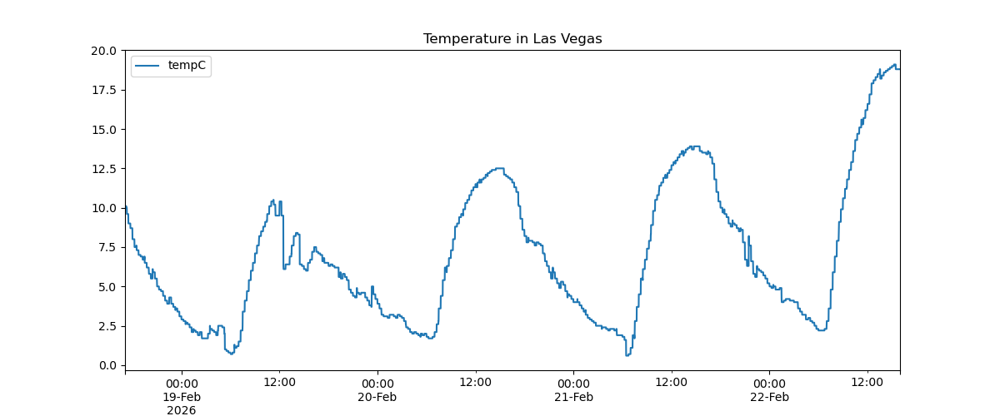
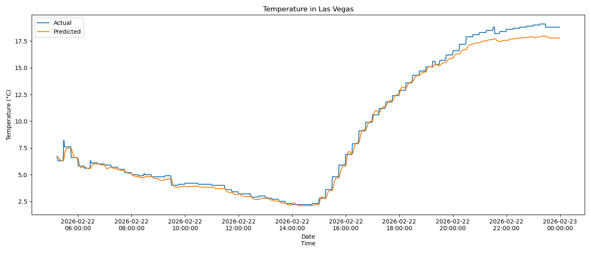

# Pipe-Dream-Machine-Learning

## Temperature Forecasting with LSTM in PyTorch

This project implements a **temperature forecasting model** using a **multivariate LSTM** in **PyTorch**, leveraging historical temperature data and cyclical time features for accurate predictions.

## Features

### Data preprocessing
- Parses historical per-city weather CSVs
- Handles missing values and irregular timestamps
- Resamples data to a regular minutely interval

### Cyclical time encoding
- Encodes hour of day and day of year as sine and cosine features to capture daily and yearly patterns

### Sequence-based LSTM
- Uses past temperature + cyclical features to predict future temperature
- Multivariate input for improved temporal modeling

### Model training
- Gradient clipping and learning rate scheduling for stable training
- Supports multi-step forecasting (e.g., next hour)
- Huber loss for robustness to outliers

### Evaluation and visualization
- Inverse scaling of predictions for interpretability
- Plots actual vs predicted temperatures
- Supports walk-forward validation for realistic performance assessment

## Results

## Potential Improvements
- Predict temperature residuals over seasonal baseline for higher accuracy
- Incorporate additional weather variables (humidity, pressure, wind speed)
    - Requires much more data
- Explore different architectures for long-range dependencies
    - Gated Recurrent Unit (GRU)
    - Temporal Convolutional Network (TCN)
    - Transformer
